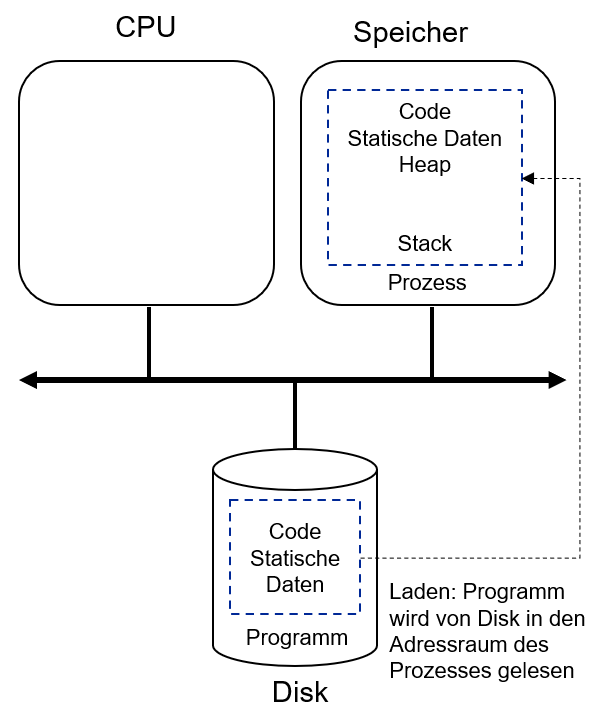
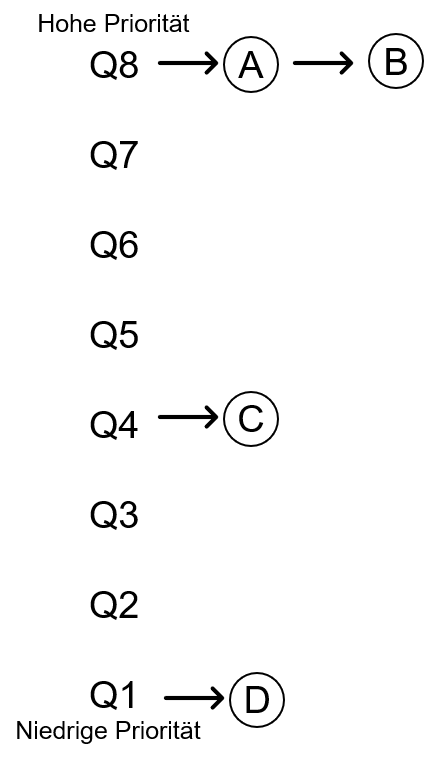
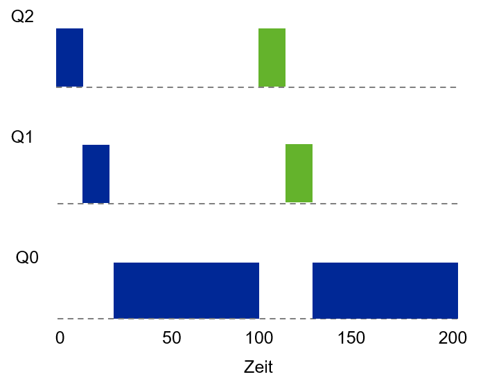
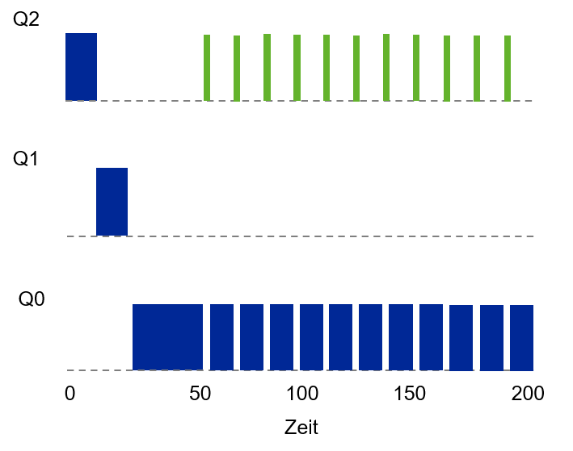
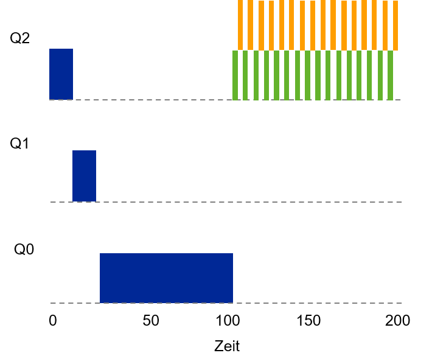
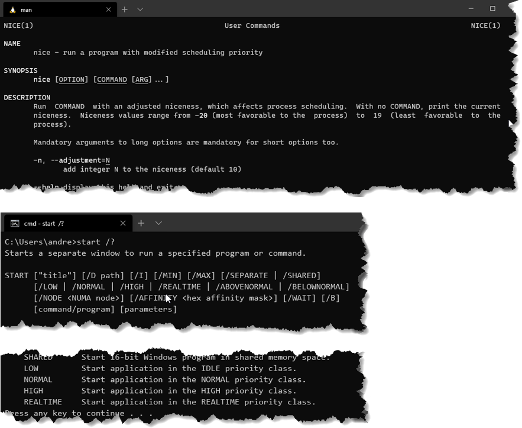

<!--

author:   Andreas Heil
email:    andreas.heil@hs-heilbronn.de
version:  0.2
language: de
narrator: DE German Male

comment:  

-->

 

# Betriebssysteme

Dieser Kurs ist Teil des Bachelor Studiengangs Software Engineering (SEB) und an der Hochschule Heilbronn.

Dies ist das Repository der Kursinformationen. Diese Seiten sind als [interaktiver Kurs verfügbar](https://liascript.github.io/course/?https://github.com/aheil/os) verfügbar.

Die Vorlesung Betriebssysteme (262007) wird von mir sowohl im Sommer- als auch dem Wintersemester im Kurs SEB2 angeboten. Die Vorlesungssprache ist Deutsch.

Die Veranstaltung basiert dabei auf dem Buch [Operating Systems: Three Easy Pieces](http://pages.cs.wisc.edu/~remzi/OSTEP/) von Rezi H. und Andrea C. Arpaci-Dussseau.

Die Vorlesung wird dabei von mir um praktische Programmübungen ergänzt.

Veranstaltungsbegleitend empfehle ich die Übungsaufgaben aus dem Buch zu bearbeiten.

Das Buch ist als [freies PDF Buch]((http://pages.cs.wisc.edu/~remzi/OSTEP/)) erhältlich. Zusätzlich finden Sie Print-Exemplare in der Bibliothek bzw. in meinem Semesterapparat am Campus Sontheim.

Für Student:innen in meinem Kurs gibt es in jedem Semester ein [ILIAS Raum](https://ilias.hs-heilbronn.de/goto.php?target=crs_360705&client_id=iliashhn) mit Forum.

## Kalender und Inhalte

| Einheit # | Datum | Thema | Hausaufgabe |
| --- | --- | --- |
|  1 | 29.09.2022 | [Einführung in Git](https://liascript.github.io/course/?https://github.com/aheil/os/blob/gh-pages/lectures/01_git.md) | Git Kurs  |
|  2 | 06.10.2022 | Virtualisierung | [C Crashkurs](https://liascript.github.io/course/?https://github.com/aheil/hhn-c) |
|  3 | 13.10.2022 | Scheduling | |
|  4 | 20.10.2022 | N.N. | |
|  5 | 27.10.2022 | N.N. | |
|  6 | 03.11.2022 | N.N. | |
|  7 | 10.11.2022 | N.N. | |
|  8 | 17.11.2022 | N.N. | |
|  - | 24.11.2022 | Entfällt (Fortbildung) | |
|  - | 01.12.2022 | Entfällt (Blockwoche SEB) | |
| 09 | 08.12.2022 | N.N. | |
| 10 | 15.12.2022 | N.N. | |
| 11 | 22.12.2022 | N.N. | |
| - | 29.12.2022 | Vorlesungsfrei | |
| - | 05.01.2023 | Vorlesungsfrei | |
| 12 | 12.01.2023 | N.N. | |
| 13 | 19.01.2023 | N.N. | |

## Kursübersicht

**Dozent**

Prof. Andreas Heil

**Kursnummer**

262007 (SEB/SPO4)

**Level**

Grundstudium Bachelor

**Semesterwochenstunden/ECTS**

2/3

**Workload**

- 30h Kontaktstunden/Lerneinheiten
- 90h Selbststudium

**Kurszeiten** 

* 1 Vorlesungseinheit / Woche, 90 Min. / Einheit

Die genauen Veranstaltungszeiten entnehmen Sie bitte dem aktuellen [Stundenplan](https://splan.hs-heilbronn.de/). 

**Voraussetzungen**

Grundlegende Programmierkenntnisse als auch ein grundlegendes Verständnis für das Themengebiet der Informatik sind hilfreich.  

Sie sollten daher die Veranstaltung *261703 Interaktive Programme* als auch *261701 Grundlagen der Informatik* besucht und erfolgreich bestanden haben. 

**Beschreibung**

Die Studierenden kennen Aufgaben, Architektur, Komponenten und Funktionsweise sowie Klassifikationen von klassischen und modernen Betriebssystemen und haben grundlegende praktische Erfahrung mit unterschiedlichen aktuellen Betriebssystemen.

- Sie wissen, wie Prozesse oder Threads beschrieben und
kontrolliert werden können.
- Sie sind in der Lage mit Nebenläufigkeit in eigenen Anwendungen umzugehen und die bekannten Synchronisationsmöglichkeiten sowie Verfahren zur Vermeidung, Umgehung oder Auflösung von Deadlocks korrekt einzusetzen.
- Die Studierenden kennen die wichtigsten Verfahren und Strategien des Speichermanagements sowie unterschiedliche Scheduling-Methoden, und sie sind in der Lage, diese in eigenen Anwendungen vorteilhaft einzusetzen.
- Sie können die Eignung verschiedener Betriebssysteme oder Betriebssystemkonzepte für neue Anwendungen, Systemanforderungen oder Rechnerarchitekturen einschätzen.

**Vorlesung**

Jede Vorlesung behandelt ein spezielles Thema. 

Die Veranstaltung basiert dabei auf dem Buch Operating Systems: Three Easy Pieces von Rezi H. und Andrea C. Arpaci-Dussseau.

Veranstaltungsbegleitend empfehle ich die Übungsaufgaben aus dem Buch zu bearbeiten.

**Klausur**

Nach der Vorlesung findet im Prüfungszeitraum eine abschließende Klausur statt. 
Die Klausur muss mit mindestens einer 4.0 bestanden werden, um den Kurs insgesamt zu bestehen.  

Die Dauer der Klausur beträgt 90 Minuten. 

Das Klausurergebnis geht dabei mit insgesamt 70% in die Bewertung der Gesamtnote ein.

**Hausaufgaben**

Es gibt nicht bewertete Übungen bzw. Hausaufgaben zu jedem Buchkapitel. Ich empfehle die Aufgaben in kleineren Lerngruppen zu bearbeiten und die Themen so aus der Vorlesung zu vertiefen.

Zusätzlich gibt es zu manchen Vorlesungseinheiten Tutorials oder Übungen, die optimalerweise im Selbststudium erarbeitet werden.

Insgesamt gibt es drei C Programmierübungen, die von Ihnen in einer kleinen Gruppe bearbeitet werden. 

Die Gruppengrößen sind abhängig von der jeweiligen Kursgröße (2er- bis 4er-Gruppen). Die Gruppen bleiben bis zum Ende des Vorlesungszeitraums für alle Abgaben bestehen. Die Kurse werden nach der ersten Vorlesungseinheit zufällig festgelegt und bekanntgegeben.
Die Programmieraufgaben werden durch die Team-Mitglieder in GitLab eingecheckt und mit dem hochschuleigenen Commit-System eingereicht. 
Die Programmieraufgaben werden zu einer gegebenen Deadline eingereicht. Nachfristen werden nicht gewährt. Einreichungen auf anderem Weg als der oben beschriebene, werden nicht gewertet.

Die Ergebnisse der Programmierübungen gehen mit insgesamt 30% in die Gesamtnote ein.

**Abgaben**

Sämtliche Abgaben erfolgen über das fakultätsinterne Commit-System unter [https://commit.it.hs-heilbronn.de](https://commit.it.hs-heilbronn.de).
Das Commit-System ist nur aus dem Hochschulnetz bzw. über VPN erreichbar.

* Link zum Commit-System: [https://commit.it.hs-heilbronn.de](https://commit.it.hs-heilbronn.de) (nur im Hochschulnetz oder via VPN)
* Link zu GitLab: [https://gitlab.it.hs-heilbronn.de](https://gitlab.it.hs-heilbronn.de)

Zur Abgabe ist es erforderlich, dass die Aufgaben zuvor im hochschuleigenen GitLab unter [https://gitlab.it.hs-heilbronn.de](https://gitlab.it.hs-heilbronn.de) eingecheckt werden. Zugänge zu dem System werden in den ersten drei Wochen des Semesters ausgegeben.

**Benotung**

Die Note ergibt sich aus insgesamt 100 Punkten: 

<!-- data-type="none"  -->
| Aktivitäten | Anteil an der Note |
| --- | --- | 
| Programmieraufgaben | 30% |
| Klausur | 70 % | 

Für das Bestehen des Kurses ist das Bestehen der Klausur mit mind. einer 4,0 erforderlich.

Durch Nichteinreichen der Programmieraufgaben (oder Ergebnisse schlechter 4,0) kann sich Ihre Gesamtnote verschlechtern.

Beispiel: Sie haben in der Klausur eine 4.0 erhalten und keine Programmieraufgaben eingereicht. So ergibt dies insgesamt eine Note schlechter als 4,0 wodurch der Kurs als nicht bestanden gewertet wird. 

Sollten Sie die Klausur nicht bestehen, werden Ihnen die Übungsaufgaben für das kommende Semester **nicht** angerechnet. Die Abgaben sind erneut einzureichen.

**Zusammenarbeit**

 Programmieraufgaben sind in der zugeteilten Gruppe zu bearbeiten. Bei Gruppenabgaben werden alle Team-Mitglieder gleichermaßen bewertet, außer mind. ein Team-Mitglied beschwert sich hinsichtlich der Bewertung. In diesem Fall findet anstelle dessen eine individuelle Bewertung statt.

Es wird empfohlen auch die Übungsaufgaben aus dem Buch in Gruppen zu erarbeiten und zu diskutieren. 
Lediglich bei den Tutorials empfiehlt es sich diese zunächst im Selbststudium zu erschließen, bevor diese in der Gruppe be- oder nachbearbeitet werden.

**Lizenz**

Sofern nicht anders angegeben, steht das gesamte Kursmaterial unter einer [Creative Commons Namensnennung 4.0 International Lizenz](https://creativecommons.org/licenses/by/4.0/). 

## Virtualisierung  

### Prozesse und Prozess API 

#### Lernziele und Kompetenzen

* **Verstehen** wie sich Prozesse zusammensetzen und Prozesse vom Betriebssystem verwaltet werden.
* **Verstehen** wie Prozesse im Betriebssystem gesteuert werden

#### Definition Prozess

**»Vereinfachte Definition«: Prozess**

Ein ausgeführtes bzw. laufendes Programm

#### Programme

Was ist überhaupt ein Programm?

    * Besteht aus Code (Bits) und ggf. statischen Daten
    * Wartet auf der Festplatte und tut nichts
    * Erst durch die Ausführung wird ein Programm zum Prozess

Was benötigt ein Programm?

    * Benötigt zur Ausführung eine CPU 
    * Benötigt für den auszuführenden Code und die Daten Speicher 

#### Illusion

**Frage:** Wie kann die Illusion vieler CPUs geschaffen werden, wenn es nur eine (oder wenige) physikalische CPUs gibt?

Beispiel rechts: Windows Task Manager mit 262 Prozesse 

#### Beispiel: Linux *top*

#### Was ist Virtualisierung? 

* Wir geben jedem Prozess die CPU für eine kurze Zeitspanne 
* Dieses sog. »Timesharing« erzeugt eine Illusion mehrerer CPUs
* Konsequenz: Programm läuft langsamer, da die CPU »geteilt« wird 

**Das ist »sehr vereinfacht« Virtualisierung**

#### Was wird für Virtualisierung benötigt?

»Low Level Machinery« 

    * Methoden und Protokolle für die grundlegende Funktionalität 

»High Level Intelligence«

    * Irgendetwas Geschicktes zum Stoppen und Starten von Programmen 
    * Zusätzliches Regelwerk (engl. policies)
    * Regeln wie viele Prozesse auf einer CPU ausgeführt werden dürfen
    * Jemand oder etwas, der bzw. das steuert, welcher Prozess als nächstes ausgeführt wird

#### Abstraktion von Prozessen

Prozesse bestehen grundlegend aus

* Speicher, in dem die Programmanweisungen bzw. Instruktionen (engl. instructions) liegen
* Speicher, in dem die Daten geschrieben werden 
* Vom Prozess adressierbarer Speicher (engl. address space)
* Registern - Instruktionen lesen und schreiben in Register, dies ist notwendig für die Ausführung d. Prozesses

    **Diese Informationen können jederzeit »weggespeichert« und wiederhergestellt werden**

#### Spezielle Register, die benötigt werden

Program Counter (Abk. PC) oder auch Instruction Counter (Abk. IC)

* Hier steht die nächste Anweisung, die ausgeführt werden soll

* Stack Pointer, Frame Pointer, Funktionsparameter, lokale Variablen und Rücksprungadressen (engl. return address) - mehr dazu später

Register für I/O-Informationen

* Liste der Dateien, die der Prozess aktuell geöffnet hat  

#### Prozess-API 

Außerdem benötigen wir eine Programmierschnittstelle (engl. process api), die jedes Betriebssystem beinhalten muss (wird später noch weiter vertieft)

* `create`: Ausgewähltes Programm wird gestartet und ein neuer Prozess erzeugt 
* `destroy`: Falls sich ein Programm nicht von selbst beendet, ist dies sehr hilfreich
* `wait`: Durchaus sinnvoll zu warten, bis ein Prozess von selbst aufhört zu laufen
* `status`: Statusinformation von Prozessen abfragen 

Weitere Möglichkeiten sind je nach Betriebssystem unterschiedlich, z.B.:
`suspend` und `resume` um Prozesse anzuhalten und weiterlaufen zu lassen

#### Wie wird ein Prozess erzeugt?

1. Voraussetzung: Ein Programm muss in ausführbarer Form vorliegen (mehr dazu später)
2. Programm und statische Daten werden in den Adressraum des Prozesses geladen
    * »Früher« wurde das gesamte Programm in den Speicher geladen (engl. eagerly)
    * »Heute« wird nur der benötigte Programm-Code und die erforderlichen Daten geladen (engl. lazy)  

        Um dieses sog. »Lazy Loading« zu verstehen, werden wir uns später noch mit »Paging« und »Swapping« befassen müssen
3. Der sog. »Stack« bzw. »Runtime Stack« wird zugewiesen
    * C nutzt den Stack für lokale Variablen, Funktionsparameter und Rücksprungadressen
4. Das Betriebssystem füllt z.B. die Parameterlisten
    * Bei C sind dies `argc` und `argv`, so dass das Programm (hier die `main`-Funktion) auf die Werte zugreifen kann[^4]
    * Kennen Sie auch aus Java
5. Nun wird noch der Heap reserviert 
    * In C für dynamischen Speicherzuordnung via `malloc()` und `free()`
    * Exkurs: Memoryleaks baut man übrigens, indem man in C vergisst `free()` aufzurufen

6. Das Betriebssystem unterstütz nun den Prozess, indem es z.B. dem Prozess mehr Speicher gibt, wenn der Heap vergrößert werden muss 
7. Nun  werden noch Input/Output-Resourcen erzeugt (sie ahnen es, später mehr dazu)

    * Unter UNIX sind dies die drei sog. »File Descriptors« (https://sites.ualberta.ca/dept/chemeng/AIX-43/share/man/info/C/a_doc_lib/aixuser/usrosdev/std_input_output.htm)
        * Standard Input, 
        * Standard Output und 
        * Standard Error Output

#### Prozess Status

Was bedeuten eigentlich die Status...?

* Laufend
* Schlafend 
* Gestoppt
* Zombie

> Tasks shown as running should be more properly thought of as 'ready to run' -- their task_struct is simply represented on the Linux run-queue. Even without a true SMP machine, you may see numerous tasks in this state depending on top's delay interval and nice value.

Quelle: https://man7.org/linux/man-pages/man1/top.1.html

#### Prozessstatus & mögliche Statusübergänge

* **Running:** Prozess läuft auf einer CPU 
* **Ready:** Prozess könnte laufen, aber das OS hat entschieden, den Prozess noch nicht laufen zu lassen
* **Blocked:** Prozess hat eine Aktion ausgeführt, die erst abgeschlossen werden kann, wenn ein anderes Ereignis stattgefunden hat - typischerweise handelt es sich hierbei um eine I/O-Operation

    Ist ein Prozess geblockt, wartet das Betriebssystem auf die I/O-Operation, um dann den Prozess wieder in den Status *Ready* zu verschieben. 

 

#### Ein kleines Problem 

Wer entscheidet eigentlich welcher Prozess als nächster gestartet wird?

Der sog. »Scheduler« trifft diese Entscheidung (später mehr dazu)

Bevor wir uns den Scheduler anschauen, müssen wir uns allerdings noch ein paar weitere Gedanken über Prozesse machen… 

#### Ein paar Gedanken zu Prozessen 

Wir benötigen
* Eine Datenstruktur für Prozesse 
* Eine Liste aller Prozesse
* Eine Liste aller blockierten Prozesse
* Eine Möglichkeit Register bei Stoppen wegzuspeichern und beim Anlaufen des Prozesses wieder zu laden (engl. context switch)

Und was passiert eigentlich, wenn ein Prozess beendet ist, aber noch nicht alles »aufgeräumt« wurde? 

In UNIX-Systemen haben solche Prozesse einen eigenen Status: **Zombie** 

#### Exkurs: Datenstruktur von xv6-Prozessen

Alle Informationen über einen Prozess stehen in einem Prozesskontrollblock (engl. process control block, kurz PCB) 

#### Zusammenfassung

* Prozesse sind die grundlegende Abstraktion eines Programmes
* Zu jedem Zeitpunkt kann ein Prozess über seinen Status, den Speicherinhalt, seinen Adressraums, den Inhalt der CPU-Register (einschl. program counter und stack pointer) und den I/O-Informationen (d.h. geöffnete Dateien) beschrieben werden
* Die Prozess-API besteht aus Aufrufen, die in Zusammenhang mit Prozessen ausgeführt werden können, z.B. zum Erzeugen oder Beenden von Prozessen
* Unterschiedliche Ereignisse führen zu Statusänderungen im Prozess (z.B. der Aufruf einer blockierenden I/O-Operation)
* Eine Prozessliste enthält alle Informationen über die Prozesse auf einem System

#### Wiederholungsfragen Prozesse und Prozess-API 

##### Welche Status von Prozessen haben Sie kennen gelernt? 

- [[x]] Laufend
- [[ ]] Wartend
- [[x]] Schlafend
- [[x]] Gestoppt
- [[ ]] Vampir
- [[x]] Zombie

#### Weiterführende Informationen 

- Windows-Prozesse mit PowerShell anzeigen, auslesen und beenden: https://www.scriptrunner.com/de/blog/windows-prozesse-mit-powershell-anzeigen-auslesen-und-beenden/ 

## Virtualisierung Teil 2
###  Direct Execution 

### Lernziele und Kompetenzen

* **Verstehen** wie Prozesse im Betriebssystem gesteuert werden
* **Verstehen** welche Probleme bei der direkten Ausführung von Prozessen auf der CPU entstehen und wie dem im Betriebssystem begegnet wird

### Problem

Bisher haben wir gelernt, dass es Prozesse gibt, diese irgendwie gestartet werden können.

Das Betriebssystem lädt also ein Programm, lädt alle Register und startet den Prozess... 

* **Frage 1:** Wie stellen wir sicher, dass der Prozess nichts »Verbotenes« tut?

* **Frage 2:** Die direkte Ausführung des Prozesses auf der CPU (engl. direct execution) ist zwar schnell, aber was passiert nun, wenn der Prozess eingeschränkte Aktionen durchführen will (z.B. mehr Speicher, I/O-Operation etc.)?

* **Frage 3:** Und wie stellen wir überhaupt sicher, dass der Prozess die Kontrolle wieder abgibt? Solange der Prozess ausgeführt wird, hat das Betriebssystem ja keine Kontrolle über die CPU... 🤔

### Lösungsidee

Programme laufen im sog. **»User Mode Linux«** oder allgemein **»User Mode«**. 

* Es wird eingeschränkt, was das Programm »tun« kann
* Z.b. werden I/O-Operationen eingeschränkt
* Wenn ein Programm versucht etwas unerlaubtes auszuführen wird eine »Exception« im Prozessor erzeugt (das heißt tatsächlich so, hat aber nichts z.B. mit Java Exceptions zu tun)

Der Gegensatz: **»Kernel Mode«**

* Hier sind alle Operationen, auch bzw. insbesondere I/O-Operationen erlaubt

### System Call 

Wenn ein Programm im *User Mode* etwas ausführen möchte, das eigentlich untersagt ist, führt es einen sog. »System Call« oder kurz »Syscall« aus.

* System Calls werden von allen modernen Betriebssystemen angeboten
* POSIX-Systeme (Portable Operating System Interface[^1]) bieten mehrere hundert solcher System Calls an 

[^1]: https://standards.ieee.org/project/1003_1.html#Standard

#### System Call Ablauf

Das Programm... 
* Führt ein sog. Trap-Instruktion aus
* Springt in Kernel und startet im privilegierten Modus (Kernel Modus)
* Führt die Operationen aus, die im »System Call Handler« hinterlegt sind
* Führt eine sog. Return-From-Trap-Instruktion aus
* Kehrt in den User Mode zurück

### Vorsicht

Die Hardware muss darauf achten „genügend Bestandteile vom Programm bestehen zu lassen“, so dass es später wieder ausgeführt werden kann.

Am Beispiel des x86: 

Hier werden...

* Program Counter, Flags und weitere Register in einen sog. Per-Process-Kernel-Stack »gepusht« (Datenstruktur Stack klar? Ggf. Exkurs am Ende)
* Bei der Return-From-Trap-Instruktion werden diese wieder vom Stack geladen
* Danach kann das Programm wieder im User Mode ausgeführt werden

Dieses Vorgehen wird von Betriebssystem zu Betriebssystem zwar unterschiedlich gehandhabt, ist im Grundsatz aber immer ähnlich

### Nochmal Vorsicht 

**Frage:** Woher weiß das OS, welcher Code für System Calls ausgeführt werden soll?

Das Programm kann ja kein Speicherbereich angeben

Grundsätzlich wäre das auch eine sehr schlechte Idee… Das ist schon klar warum , oder?

### Trap Table 

**Lösung:** 

* Es wird eine sog. »Trap Table« zur Boot-Zeit erstellt
* Beim Booten ist das System immer im Kernel Mode
* Das Betriebssystem kann der Hardware somit sagen, welcher Code bei welchem Ereignis ausgeführt wird 
* Das Betriebssystem informiert die Hardware über diese sog. Trap Handlers oder System Call Handlers

Nur mal so... Was könnte man denn machen, wenn man eine eigene Trap Table installieren könnte? 🤔

### Zusammenfassung

* Prozesse direkt (d.h. ohne Kontrolle) auf der Hardware auszuführen, ist keine gute Idee 
* Prozesse werden im User Mode ausgeführt und sind eingeschränkt was bestimmte Aktionen angeht 
* Mittels System Calls kann ein Prozess spezielle Aktionen ausführen (lassen), die jedoch vom Betriebssystem kontrolliert werden
* Eine Trap Table enthält die Information darüber, wo der Code steht, der durch ein System Call ausgeführt wird 
* Trap Tables werden zur Boot-Zeit (im Kernel Modus) erzeugt

## Scheduler  Teil 1

### CPU-Scheduling 

### Wiederholung

* Direct Execution

    * Weshalb ist es keine gute Idee, Prozesse direkt auszuführen? 

* SysCalls

  * Woher weiß die Hardware, welcher Betriebssystem-Code ausgeführt werden soll?  
  * Wie lässt sich dies als Angriffsvektor nutzen?

* Stack

    * Wie ist die grundlegende Funktionsweise eines Stacks?

### Lernziele und Kompetenzen

* Grundlagen der Scheduling-Mechanismen **kennen lernen** 
* **Verstehen** wie Prozesse von Betriebssystemen »gescheduled« werden können

### Eine kurze Wiederholung

Bisher kennen gelernt:

* »Low-Level-Mechanismen« von laufenden Prozessen (z.B. Context Switch)
* Falls nicht klar, Einheit 1 wiederholen + Kapitel 4-6 aus *Operating Systems: Three Easy Pieces*[^1] wiederholen

Was fehlt noch? 

* Wann darf welcher Prozess laufen (engl. scheduling)

[^1]: http://pages.cs.wisc.edu/~remzi/OSTEP/

### Scheduling Policy

* Die »Scheduling Policy« (also das Regelwerk) hängt vorrangig vom »Workload« der Prozesse ab
* Zur Vereinfachung werden zunächst folgende (absolut unrealistische) Annahmen getroffen:

  * Jeder Job läuft gleich lang
  * Alle Jobs treffen zur gleichen Zeit ein
  * Einmal gestartet, läuft ein Job bis er beendet ist
  * Alle Jobs verwenden ausschließlich die CPU
  * Laufzeit (engl. runtime) eines jeden Jobs ist bekannt

---

### Scheduler Metriken: Turnaround-Zeit

* Hinweis: Metriken werden im 3. Semester in SEKS vertieft 
* Für heute genügt: Metrik = einfach um etwas zu messen
* Für uns: zunächst nur eine Metrik

$$
T_{turnaround}=T_{completion}-T_{arrival}
$$

Aufgrund unserer vorherigen Annahmen gelten

* Alle Jobs kommen zum  gleichen Zeitpunkt an: $T_{arrival} = 0$
* Somit gilt: $T_{turnaround}=T_{completion}$

---

### First In, First Out (1)

First in, First out (abk. FIFO) oder manchmal auch First Come, First Serve (abk. FCFS)

* Einfach und daher auch einfach zu implementieren
* Beispiel

  * Jobs A, B und C kommen kurz nacheinander an
  * Jeder Job hat eine Laufzeit von 10 Sekunden
  * Was ist die durchschnittliche Turnaround-Zeit?
  * $\frac{10+20+30}{3}=20$

### First In, First Out (2)

* Heben wir jetzt die erste Annahme auf

  * Zur Erinnerung: Jeder Job läuft gleich lang
  * Ab sofort: Jeder Job läuft eben nicht mehr gleich lang
  * Gibt es einen Workload, der FIFO »alt aussehen lässt«?
  * $\frac{100+110+120}{3}=110$

### Convoy Effect (dt. Konvoieffekt)

* Kennt jeder
* Mehrere Kunden mit wenigen Waren warten hinter einem einzigen Kunden mit vielen Waren 
* Nur eine Supermarktkasse offen... 😤

[^2]

[^2]: Photo by Paul Townsend, licensed under Attribution-ShareAlike 2.0 Generic (CC BY-SA 2.0)

### Shortest Job First

* Shortest Job first (Abk. SJF)
* Beschreibt die Policy recht treffend 

    * Führt den kürzesten Job aus, dann den zweit kürzesten etc.

* Beispiel von zuvor

    * SJF reduziert Turnaround-Zeit von 110 auf 50 

* $\frac{10+20+120}{3}=50$

### Problem bei SJF

* Lösen wir ab jetzt die Restriktion, dass alle Jobs zum selben Zeitpunkt eintreffen
* Beispiel: A trifft bei $𝑡=0$, B und C bei $𝑡 = 10$ ein
* Turnaround-Zeit hat sich hierdurch verdoppelt
* $\frac{100+(110-10)+(120-10)}{3}=103,33$

### Exkurs: Non-Preemptive vs. Preemptive 

* Non-Preemptive 

    * Stammt aus den Zeiten von sog. Batch-Systemen
    * Jeder Job wurde zu Ende gerechnet, bevor überhaupt in Erwägung gezogen wurde einen anderen Job zu starten 

* Preemptive

    * Alle modernen Betriebssysteme sind »preemptive«
    * Jederzeit gewillt einen Job zu stoppen und einen anderen dafür zu starten
    * Nutzen den zuvor behandelten Context Switch

### Shortest Time-to-Completion First (STCF)

* SJF ist non-preemptive ▶ versuchen wir es preemptive
* Lösen wir nun die Restriktion, dass alle Jobs bis zum Ende durchlaufen 
* Jedes Mal wenn ein Job eintrifft, wird derjenige der die geringste Restlaufzeit
* **Achtung!** Das geht nur wegen unserer letzten noch bestehenden Annahme: Die (Rest-)Laufzeit ist bekannt! 

* $\frac{(120-0)+(20-10)+(30-10)}{3}=50$

[^3]

[^3]: Bild von Gerd Altmann auf Pixabay

### Problem mit STCF

* Benutzer wartet bis Job A (z.B. Aktualisierung in Excel o.ä.) fertig ist
* Nun kommt die Hausaufgabe vom letzten Mal ins Spiel: Sie erinnern sich an den Unterschied zwischen Foreground- und Background-Jobs?  
* Was ist denn, wenn andauernd neue kürzere Jobs eintreffen, die keine Benutzereingabe erfordern… 🥱

### Scheduler Metriken: Antwortzeit

* Zweite Metrik für heute: Antwortzeit (eng. response time)
* Dauer vom Zeitpunkt an dem Job eintrifft bis er das erste Mal »gescheduled« wird
* $\frac{0 + 5 + 10}{3}=5$

$$
T_{response}=T_{firstrun}-T_{arrival}
$$

### Round Robin (RR)

* Grundprinzip: Jeder Job wird nur für eine bestimmte Zeitspanne (engl. time slice) ausgeführt 
* Zeitscheibe ist ein Vielfaches vom Timer Interrupt (d.h. bei einem Timer Interrupt von 10ms ein Vielfaches von 10)
* Durchschnittliche Antwortzeit im Vergleich zu SJF (vorherige Folie) ist 1
* $\frac{0 + 1 + 2}{3}=1$

### Round Robin (Forts.)

* Der Context Switch kostet Ressourcen
* D.h. wie lange müssten die Time Slices sein, dass sich ein Context Switch überhaupt lohnt?
* Für Antwortzeit hervorragend geeignet, für Turnaround-Zeit überhaupt nicht
* Round Robin zieht Ausführungsdauer in die Länge, in manchen Fällen ist die Ausführung sogar schlechter als FIFO  
* Allgemein lässt sich festhalten: Jede Policy die fair ist, d.h. die CPU auf Prozesse aufteilt, führt zu einem schlechten Ergebnis in Bezug auf Turnaround-Zeit 

---

### Kurzer Zwischenstand

* Wir haben zwei Typen von Schedulern kennen gelernt 

    * SJF/STCF optimiert Turnaround-Zeiten, ist jedoch ungünstig für Antwortzeiten 
    * RR optimiert die Antwortzeit, ist aber ungünstig für die Turnaround-Zeit

* Es gibt noch zwei Annahmen/Restriktionen, die »aufgelöst« werden müssen

    4. Alle Jobs verwenden ausschließlich die CPU
    5. Laufzeit eines jedes Jobs ist bekannt

---

### Input/Output

* Lösen wir die nächste Restriktion: Ab sofort können Jobs auch I/O-Operationen aufrufen
* Scheduler muss nun entscheiden wann eine I/O-Operation durchgeführt wird, da in der Zeit der laufende Prozess die CPU nicht nutzen kann und sich somit im Status »blocked« befindet
* Scheduler kann demnach in dieser Zeit einen anderen Job laufen lassen
* Ist die I/O-Operation fertig (wird über Interrupt angezeigt), wird der zuvor geblockte Job wieder auf »ready« gesetzt
* Ab jetzt kann er Job potentiell wieder laufen

### Overlapping

* Schlechte Ressourcen-Nutzung

* Bessere Ressourcen-Nutzung dank Overlapping

### Kein Wissen über Prozessdauer

* Als letzte Restriktion lösen wir nun die Kenntnisse über die Prozesslaufzeit auf 
* D.h. der Scheduler weiß nichts über die Restlaufzeit eines Prozesses
* Wie kann dann sinnvoll gescheduled werden? 

Lösungsidee: sog. »Multi-Level Feedback Queue«-Ansätze verwenden die nahe Vergangenheit, um die Zukunft vorauszusagen! 🤩

## Scheduler Teil 2 

### Multi-Level Feedback Queue

### Lernziele und Kompetenzen

* Grundlagen des Scheduling-Verfahrens mit Multi-Level Feedback Queues **kennen lernen** 

### Wiederholung

* Zuletzt wurde die Annahme fallen gelassen, dass wir die Laufzeit eines Prozesses im Vorhinein wissen
* Wie kann ohne diese Kenntnisse ein Scheduler gebaut werden, er sowohl Antwortzeiten (z.B. für interaktive Anwendungen) als auch die Turnaround-Zeiten (d.h. ein Job möglichst schnell fertig stellen) ohne Wissen über die Laufzeit eines Prozesses minimiert?

### Lösungsidee: Multi Level Feedback Queue (MLFQ)

Grundlegende Regeln

* MLFQ hat mehrere Queues, jede mit einem Prioritäts-Level
* Jobs mit höherer Priorität laufen zuerst (=höhere Queue)
* Falls sich mehrere Jobs in der gleichen Queue befinden gilt:

  * Regel 1: `If Priority(A) > Priority(B), A runs (B doesn‘t)`
  * Regel 2: `If Priority(A) == Priority(B), A & B run in Round Robin`

* Wie wird jedoch die Priorität für ein Job festgelegt?

  * Priorität  nicht fix, sondern hängt vom **beobachteten Verhalten** des Jobs ab

* Wenn die ganze CPU-Zeit auf A und B verteilt wird, wie kommen dann aber C und D zum Zug? 

### MLFQ Beispiel

### 1. Versuch - Prioritäten ändern

* Workload Betrachtung: Mischung aus...

  * interaktiven Jobs, die kurz laufen, geben CPU schnell wieder frei und
  * langlaufende Jobs, die die CPU-intensiv in Anspruch nehmen, aber deren Antwortzeit »nicht relevant« ist. 

* Zusätzliche Regeln:

  * Regel 3: Ein neu eintreffender Job erhält immer die höchste Priorität (oberste Queue)
  * Regel 4a: Wenn ein Job die gesamte Zeitscheibe aufbraucht, wird seine Priorität herabgestuft (d.h. eine Queue nach unten geschoben)
  * Regel 4b: Wenn ein Job die CPU vor Ablauf der Zeitscheibe freigibt, bleibt er auf der gleichen Priorität (d.h. bleibt in der aktuellen Queue)

### Beispiel 1: Ein langlaufender job 

* Job läuft immer bis ans Ende der Time Slice 
* Nach jeder Time Slice wird der Job heruntergestuft
* Am Ende läuft der Job auf der niedrigsten Priorität

### Beispiel 2: Ein zusätzlicher »Kurzläufer«

* Bei $𝑇 = 100$ trifft ein zweiter, kurzlaufender Job ein
* MLFQ trifft immer die Annahme, dass ein neuer Job ein »Kurzläufer« ist 

### Beispiel 3: Zusätzliche I/O

* Mischung aus I/O-intensivem und CPU-intensivem Job
* Nach Regel 4 bleibt der Job, der die CPU schnell freigibt, weil er z.B. auf die Tastatur wartet, hoch priorisiert
* Wer sieht denn das Problem?

### Game the Scheduler

* Programm so schreiben, dass es kurz vor Ablauf der Zeitscheibe einen Dateizugriff ausführt (die Datei selbst ist uns komplett egal)
* Programm bleibt hoch priorisiert, da Zeitscheibe nicht vollständig aufgebraucht
* Machen wir das immer bei ≈ 99% der Zeitscheibe, könnten wir die CPU 99% übernehmen
* Langlaufende Jobs bleiben auf der Strecke (engl. starvation)
* Job A kommt nie mehr in eine bessere Queue, selbst wenn sich sein Verhalten ändert 

### Game the Scheduler

Wie könnten wir das besser machen?

---

### Versuch 2: Priority Boost

* Neue Regel
    
    * Regel 5: Nach definierten Zeit *s* werden alle Jobs wieder in die oberste Queue verschoben

* Regel 5 löst zwei Probleme:

    * Prozesse laufen nicht mehr Gefahr der »Starvation«
    * Wenn ein Job »plötzlich« interaktiv würde, kann er entsprechend priorisiert werden (s. nächste Seite)

### Voodoo Constant 

Spannende Frage: Wie lange sollte die Zeitspanne *s* sein?

* Der Wert *s* heißt nach John Ousterhout »Voodoo Constant«.
* Für die Bestimmung sog. Voodoo-Konstanten benötigt das System etwas »schwarze Magie« zu deren Bestimmung
* Dilemma: Wenn *s* zu groß gewählt wird, können CPU-intensive Jobs doch verhungern, ist sie zu klein gewählt bekommen interaktive Jobs nicht genügend CPU  
* Generell sollten Voodoo-Konstanten vermieden werden (Ousterhout's Law)

### Versuch 3: Verbesserte Buchführung

* Problem: Regel 4a und 4b ermöglichen immer noch, dass der Scheduler ausgespielt wird 
* Lösungsidee: Eine verbesserte Buchführung
* Merken wie viel Zeit ein Prozess in einer Queue verbracht hat
* Sobald ein Prozess kumuliert eine Zeitscheibe aufgebraucht hat, wandert er eine Queue nach unten
* Aus den Regeln 4a und 4b wird
  * Regel 4: Sobald ein Job seine gesamte Zeit auf einer Prioritätsebene genutzte hat (ungeachtet dessen, wie viel Zeit er der CPU  »zurück gibt«), wird seine Priorität reduziert (d.h. er wandert eine Queue nach unten). 

### Tuning und MLFQ Probleme 

* Wie sollte MLFQ priorisiert werden?
* Wie viele Queues 
* Wie groß sollte die Zeitspanne (engl. time slice) pro Queue sein?
* Machen unterschiedliche Time Slices pro Queue Sinn?
* Wie oft findet Priority Boost statt?

### MLFQ Regeln 

* **R 1**: If Priority(A) > Priority(B), A runs (B doesn’t)
* **R 2**: If Priority(A) = Priority(B), A & B run in round-robin fashion using the time slice (quantum length) of the given queue.
* **R 3**: When a job enters the system, it is placed at the highest priority (the topmost queue).
* **R 4**: Once a job uses up its time allotment at a given level (regardless of how many times it has given up the CPU), its priority is reduced (i.e., it moves down one queue).
* **R 5**: After some time period *s*, move all the jobs in the system to the topmost queue. 

### Wird MLFQ überhaupt irgendwo verwendet?

* Solaris

  * MLFQ *Time-Sharing Scheduling Class* wird über eine Reihe von Tabellen konfiguriert
  * Diese können durch einen Admin angepasst werden 😱
  * 60 Queues, mit langsam steigenden Time Slices von 20 ms bis zu 1 Sekunde 

* FreeBSD 

  * Scheduler nutzt Formel um Priorität eines Jobs zu berechnen
  * Wie viel CPU hat der Prozess schon verbraucht + wie ist  der Verbrauch abgefallen (sog. Decay-Usage Algorithms)

### Be Nice 

* Unix Betriebssysteme nehmen »Hinweise« von Nutzern und Administratoren bzgl. der Priorisierung von Jobs entgegen. 
* Unter Windows kann man beim Start eines Prozesses mittels `start` die Priorität des Prozesses angeben
* Hausaufgabe: Machen Sie sich mit dem Befehl `nice` (Linux) und `start` (Windows) vertraut

## Scheduler Teil 3

### Lottery Scheduling

### Lernziele und Kompetenzen

* Grundlagen des Lottery-Scheduling-Verfahrens **kennen lernen** 

### Proportional / Fair Share Scheduler

* Anstelle Turnaround-Zeiten zu optimieren, versuchen Fair Share Scheduler sicherzustellen, dass jeder Job einen gewissen Prozentsatz der CPU-Ressourcen erhält

* Beispiel: Lottery Scheduling
* Grundidee: Es werden Tickets vergeben, die wie in einer Lotterie gezogen werden
* Prozesse, die öfters laufen sollen, erhalten schlicht mehr Lotterielose… 

Einfach, oder? 🤔

### Grundkonzept: Tickets represent your share

* Grundlegendes Konzept: Es werden Tickets vergeben (entsprechen einem CPU Share)
* Beispiel:

  * Job A erhält 75% der Tickets (hier: Lose 0..74)
  * Job B erhält  25%  der Tickets (hier: Lose 75..99)
  * Scheduler muss nun wissen, wie viele Lose es insgesamt gibt (hier: 100)
  * Gewinnerticket gibt an, welcher Prozess läuft

### Lottery Scheduler - Überlegungen

* Statistische Annäherung an gewünschte Aufteilung 
* Je länger die Jobs laufen, desto besser ist die Annäherung 
* Was ist bei einer Verteilung 99% zu 1%?
* Man benötigt einen guten Zufallsgenerator
* Was macht man wenn ein neuer Job dazu kommt? 

### Ticket Währung

User mit mehreren Tickets, kann diese einer eigene »Währung« zuordnen 

* Beispiel

  * A und B haben je 100 Tickets 
  * A hat zwei Jobs, A1 und A2, jeder Job bekommt 500 (von insg. 1.000) User Tickets in A‘s Währung 
  * B hat 1 Job B1, dieser bekommt 10 von 10 (User Tickets) in B‘s Währung
  * System konvertiert A‘s Tickets pro Job zu je 50 Tickets in der Systemwährung
  * System konvertiert B‘s Ticktes zu 100 Tickets in Systemwährung

### Ticket Transfer

Prozess kann temporär Tickets auf einen anderen Prozess übertragen

* Beispiel: 

  * Client-Server Mechanismus (lokal)
  * Client, der eine Anfrage von einem Server wartet, kann seine Tickets dem Server geben, um die Antwort zu beschleunigen 
  * Nach Beendigung gibt der Server die Tickets an den Client zurück 

### Linux Completely Fair Scheduler (CFS)

* Problem: Scheduling kann bis zu 5% der CPU-Ressource ausmachen 
* CFS führt eine virtual runtime (*vruntime*) ein
* Jeder Prozess, der läuft, sammelt *vruntime* an
Bei Scheduling-Entscheidung wählt der Scheduler den Prozess mit der geringsten vruntime aus

### CFS: Wie oft sollte ein Prozess gewechselt werden?

* *sched_latency*

  * Time Slice Dauer, typischerweise 48ms 
  * Wird durch Anzahl der Prozesse *n* geteilt
  * Ergibt die Zeitscheibe pro Prozess
  * Somit ist die Zeitverteilung vollständig fair 

* *min_granularity*

  * Mindestdauer, typischerweise 6ms
  *  Dieser Wert wird niemals unterschritten (Bsp. 10 Prozesse ergäbe 4,8ms pro Prozess)

* CFS nutzt regelmäßige Timer Interrupts, der Scheduler kann Entscheidungen also immer nur zu fixen Zeitpunkten treffen

---

### CFS - Beispiel

* Vier Jobs (A,B,C,D), wobei B, C und D kurz nach A eintreffen
* Nach der ersten Zeitscheibe wird einer der Jobs aus (B,C,D) gewählt da hier vruntime von B, C und D < vruntime von A
* Nach *t = 100* sind C und D fertig, danach wird die vruntime zwischen A und B aufgeteilt 

### CFS - Weighting / Niceness

CFS ermöglicht die Angabe von Prioritäten, damit Prozesse mehr CPU-Ressourcen erhalten können. 

* In UNIX entspricht das dem »nice level«
* Kann zwischen -20 und + 19 gesetzt werden
* 0 ist Standardwert
* < 0 höhere Prio, > 0 kleinere Prio

### CFS: Zeitscheibe berechnen

* Gewichtungen erlauben es die Zeitscheibe pro Prozess zu berechnen:

$$
time\_sclice_k = \frac{weight_k}{\sum\limits_{i=0}^{n}weight_i}\cdot sched\_latency
$$

* Beispiel:

  * 2 Prozesse A (Prio=-5), B (Prio=0)
  * $𝑤𝑒𝑖𝑔ℎ𝑡_𝐴$  = 3121, $𝑤𝑒𝑖𝑔ℎ𝑡_𝐵$=1024    
  * A erhält 36ms, B erhält 12ms

### prio_to_weight

### CFS: vruntime berechnen

* Berechnet wieviel Laufzeit ein Prozess imVerhältnis zur Gewichtung genutzt hat

$$
vruntime_i = vruntime\cdot \frac{weight_0}{weight_i} \cdot runtime_i
$$

* Hinweis:

  * Gewichtung bleibt im Verhältnis gleich, wenn andere Prioritäten gewählt werden
  * Annahme A hat 5 und B hat 10
  * A und B werden noch im selben Verhältnis wie zuvor gescheduled

### CFS Prozesslisten

* Problem: Bei mehreren hundert oder gar 1.000 Prozessen, wie wird der nächste Prozess gefunden?
* Kurzes Gedankenspiel: Skalieren Listen? Hier müssten man immer aller linear durchsuchen, was in einem linearen Aufwand von $𝑂(𝑛)$ resultiert.  
* Lösung: Geschickte Wahl der Datenstruktur:

  * CFS speichert Prozesse in Rot-Schwarz-Bäumen (ausgeglichener Baum)
  * Algorithmen auf Rot-Schwarz-Bäumen sind logarithmisch mit einem Aufwand von $𝑂(l𝑜𝑔_𝑛)$ 

* Deswegen: Algorithmen und Datenstrukturen

### CFS und I/O

* Was passiert eigentlich wenn ein Prozess A permanent läuft, weil B aufgrund einer I/O-Operation blockiert (z.B. 10s)?
* B wacht auf und hat die niedrigste vruntime (10s kleiner als bei A)
* B würde nun die CPU für 10s monopolisieren, »Starvation« von A wäre potentiell möglich

* Lösung: CFS setzt die *vruntime* zurück

  * Sobald ein Job aufwacht, erhält er den Minimum Wert im Baum (Liste aller laufende Jobs)
  * »Starvation« wird vermieden
  * Nachteil: Jobs, die nur kurz schlafen, bekommen hierdurch keinen fairen Anteil   

### Abschluss

* Am Beispiel des CFS sieht man, dass die Wahl einer geeigneten Datenstruktur eine signifikante Auswirkung auf ein System haben kann 
* Deswegen macht es durchaus Sinn, sich mit dem Thema *Algorithmen und Datenstrukturen* in SEB3 auseinanderzusetzen

### Referenzen 

[1]	By Cburnett - Own work, CC BY-SA 3.0, https://commons.wikimedia.org/w/index.php?curid=1508398

## Hausaufgaben

### Einheit 1 (Git)

- Udacity Kurs zum Thema Git: [https://www.udacity.com/course/version-control-with-git--ud123]https://www.udacity.com/course/version-control-with-git--ud123
- 1x in GitLab (https://git.it.hs-heilbronn.de) anmelden
- C-Crashkurs durcharbeiten: https://github.com/aheil/hhn-c

### Einheit 2 (Prozess API)

- Bearbeiten Sie die Übungsaufgaben zum Thema Process API aus dem OSTEP-Buch [https://pages.cs.wisc.edu/~remzi/OSTEP/cpu-api.pdf](https://pages.cs.wisc.edu/~remzi/OSTEP/cpu-api.pdf)
