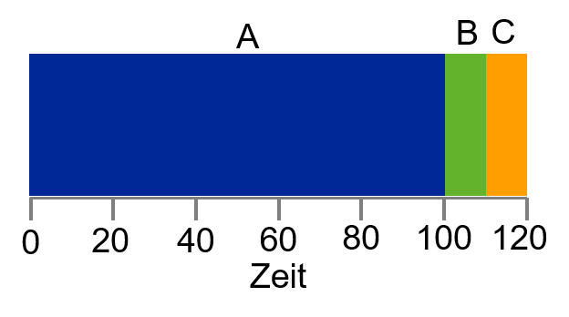
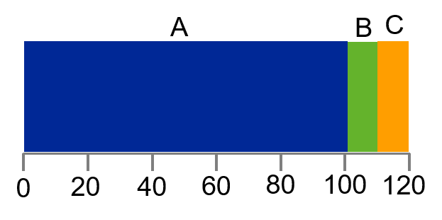

<!--

author:   Andreas Heil

email:    andreas.heil@hs-heilbronn.de

version:  0.1

language: de

narrator: DE German Male

tags: betriebssysteme, lecture, scheduler

comment:  

-->

# Scheduler

<!-- data-type="none" -->
| Parameter | Kursinformationen |
| --- | --- |
| **Veranstaltung:** | `262007 Betriebssysteme`|
| **Semester** | `SEB2` |
| **Hochschule:** | `Hochschule Heilbronn` |
| **Inhalte:** | `Scheduler` |
| Startseite | [https://liascript.github.io/course/?https://raw.githubusercontent.com/aheil/os/master/README.md#1](https://liascript.github.io/course/?https://raw.githubusercontent.com/aheil/os/master/README.md#1) | 
| **Link auf den GitHub:** | [https://github.com/aheil/os/blob/main/lectures/03_scheduler.md](https://github.com/aheil/os/blob/main/lectures/03_scheduler.md) |
| **Autoren** | @author |

## Lernziele und Kompetenzen

* **Verstehen** wie Prozesse im Betriebssystem gesteuert werden
* **Verstehen** welche Probleme bei der direkten Ausführung von Prozessen auf der CPU entstehen und wie dem im Betriebssystem begegnet wird
* Grundlagen der Scheduling-Mechanismen **kennen lernen** 
* **Verstehen** wie Prozesse von Betriebssystemen geschedult werden können

## Direct Execution 

**Problem**

Bisher haben wir gelernt, dass es Prozesse gibt, diese irgendwie gestartet werden können.

Das Betriebssystem lädt also ein Programm, lädt alle Register und startet den Prozess... 

Der Prozess bekommt vollen Zugriff auf alle Ressourcen und läuft direkt auf der CPU, bis der Prozess die Kontrolle wieder an das Betriebssystem abgibt (engl. direct execution). 

* **Frage 1:** Wie stellen wir sicher, dass der Prozess nichts »Verbotenes« tut?

* **Frage 2:** Die direkte Ausführung des Prozesses auf der CPU (engl. direct execution) ist zwar schnell, aber was passiert nun, wenn der Prozess eingeschränkte Aktionen durchführen will (z.B. mehr Speicher, I/O-Operation etc.)?

* **Frage 3:** Und wie stellen wir überhaupt sicher, dass der Prozess die Kontrolle wieder abgibt? Solange der Prozess ausgeführt wird, hat das Betriebssystem ja keine Kontrolle über die CPU... 🤔

{{1}}
************************************

**Lösungsidee**

Programme laufen im sog. **»User Mode Linux«** oder allgemein **»User Mode«**. 

* Es wird eingeschränkt, was das Programm »tun« kann
* Z.b. werden I/O-Operationen eingeschränkt
* Wenn ein Programm versucht etwas unerlaubtes auszuführen wird eine »Exception« im Prozessor erzeugt (das heißt tatsächlich so, hat aber nichts z.B. mit Java Exceptions zu tun)

Der Gegensatz: **»Kernel Mode«**

* Hier sind alle Operationen, auch bzw. insbesondere I/O-Operationen erlaubt

************************************

## SysCall

Wenn ein Programm im *User Mode* etwas ausführen möchte, das eigentlich untersagt ist, führt es einen sog. »System Call« oder kurz »Syscall« aus.

* System Calls werden von allen modernen Betriebssystemen angeboten
* POSIX-Systeme (Portable Operating System Interface[^1]) bieten mehrere hundert solcher System Calls an 

[^1]: https://standards.ieee.org/project/1003_1.html#Standard

### System Call Ablauf

Das Programm... 

* Führt ein sog. Trap-Instruktion aus
* Springt in Kernel und startet im privilegierten Modus (Kernel Modus)
* Führt die Operationen aus, die im »System Call Handler« hinterlegt sind
* Führt eine sog. Return-From-Trap-Instruktion aus
* Kehrt in den User Mode zurück

{{1}}
************************************

**Vorsicht**

Die Hardware muss darauf achten „genügend Bestandteile vom Programm bestehen zu lassen“, so dass es später wieder ausgeführt werden kann.

Am Beispiel des x86: 

Hier werden...

* Program Counter, Flags und weitere Register in einen sog. Per-Process-Kernel-Stack »gepusht« (Datenstruktur Stack klar? Ggf. Exkurs am Ende)
* Bei der Return-From-Trap-Instruktion werden diese wieder vom Stack geladen
* Danach kann das Programm wieder im User Mode ausgeführt werden

Dieses Vorgehen wird von Betriebssystem zu Betriebssystem zwar unterschiedlich gehandhabt, ist im Grundsatz aber immer ähnlich

************************************

{{2}}
************************************

**Nochmal Vorsicht**

**Frage:** Woher weiß das OS, welcher Code für System Calls ausgeführt werden soll?

Das Programm kann ja kein Speicherbereich angeben

Grundsätzlich wäre das auch eine sehr schlechte Idee… Das ist schon klar warum , oder?

************************************

{{3}}
************************************

**Lösung: Trap Table ** 

* Es wird eine sog. »Trap Table« zur Boot-Zeit erstellt
* Beim Booten ist das System immer im Kernel Mode
* Das Betriebssystem kann der Hardware somit sagen, welcher Code bei welchem Ereignis ausgeführt wird 
* Das Betriebssystem informiert die Hardware über diese sog. Trap Handlers oder System Call Handlers

> Nur mal so... Was könnte man denn machen, wenn man eine eigene Trap Table installieren könnte? 🤔

************************************

### Zusammenfassung

* Prozesse direkt (d.h. ohne Kontrolle) auf der Hardware auszuführen, ist keine gute Idee 
* Prozesse werden im User Mode ausgeführt und sind eingeschränkt was bestimmte Aktionen angeht 
* Mittels System Calls kann ein Prozess spezielle Aktionen ausführen (lassen), die jedoch vom Betriebssystem kontrolliert werden
* Eine Trap Table enthält die Information darüber, wo der Code steht, der durch ein System Call ausgeführt wird 
* Trap Tables werden zur Boot-Zeit (im Kernel Modus) erzeugt

## Scheduler 

Der Scheduler regelt nun, welcher Prozess laufend darf, und wann der nächste Prozess dran ist, wie genau macht der Scheduler das jedoch? Hierfür wird ein Regelwerk benötigt.

{{1}}
************************************

**Scheduling Policy**

* Die »Scheduling Policy« (also das Regelwerk) hängt vorrangig vom »Workload« der Prozesse ab
* Zur Vereinfachung werden zunächst folgende (absolut unrealistische) Annahmen getroffen:

  * Jeder Job läuft gleich lang
  * Alle Jobs treffen zur gleichen Zeit ein
  * Einmal gestartet, läuft ein Job bis er beendet ist
  * Alle Jobs verwenden ausschließlich die CPU
  * Laufzeit (engl. runtime) eines jeden Jobs ist bekannt

************************************

{{2}}
************************************

Um die Scheduling Policy zu bewerten benötigen wir eine Kennzahl, eine sog Metrik:

* Hinweis: Metriken werden im 3. Semester in SEKS vertieft 
* Für heute genügt: Metrik = einfach um etwas zu messen
* Für uns: zunächst nur eine Metrik

**Scheduler Metriken: Turnaround-Zeit**

$$
T_{turnaround}=T_{completion}-T_{arrival}
$$

Aufgrund unserer vorherigen Annahmen gelten

* Alle Jobs kommen zum  gleichen Zeitpunkt an: $T_{arrival} = 0$
* Somit gilt: $T_{turnaround}=T_{completion}$

************************************

### First In, First Out 

First in, First out (abk. FIFO) oder manchmal auch First Come, First Serve (abk. FCFS)

{{1}}
************************************

* Einfach und daher auch einfach zu implementieren

* Beispiel

  * Jobs A, B und C kommen kurz nacheinander an
  * Jeder Job hat eine Laufzeit von 10 Sekunden
  * Was ist die durchschnittliche Turnaround-Zeit?
  * $\frac{10+20+30}{3}=20$

************************************

{{2}}
************************************

* Heben wir jetzt die erste Annahme auf

  * Zur Erinnerung: Jeder Job läuft gleich lang
  * Ab sofort: Jeder Job läuft eben nicht mehr gleich lang
  * Gibt es einen Workload, der FIFO »alt aussehen lässt«?
  * $\frac{100+110+120}{3}=110$

************************************

{{3}}
************************************

**Convoy Effect (dt. Konvoieffekt)**

* Kennt jeder
* Mehrere Kunden mit wenigen Waren warten hinter einem einzigen Kunden mit vielen Waren 
* Nur eine Supermarktkasse offen... 😤

[^2]

[^2]: Photo by Paul Townsend, licensed under Attribution-ShareAlike 2.0 Generic (CC BY-SA 2.0)

************************************

### Shortes Job First

* Shortest Job first (Abk. SJF)
* Beschreibt die Policy recht treffend 

    * Führt den kürzesten Job aus, dann den zweit kürzesten etc.

* Beispiel von zuvor

    * SJF reduziert Turnaround-Zeit von 110 auf 50 

* $\frac{10+20+120}{3}=50$

{{1}}
************************************

**Problem bei SJF**

* Lösen wir ab jetzt die Restriktion, dass alle Jobs zum selben Zeitpunkt eintreffen
* Beispiel: A trifft bei $𝑡=0$, B und C bei $𝑡 = 10$ ein
* Turnaround-Zeit hat sich hierdurch verdoppelt
* $\frac{100+(110-10)+(120-10)}{3}=103,33$

************************************

### Shortest Time-to-Completion First

* Shortest Time-to-Completion First (STCF)

* SJF ist non-preemptive ▶ versuchen wir es preemptive
* Was bedeutet überhaupt preemptive bzw. non-preemptive?

{{1}}
************************************

**Exkurs: Non-Preemptive vs. Preemptive** 

* Non-Preemptive 

  * Stammt aus den Zeiten von sog. Batch-Systemen
  * Jeder Job wurde zu Ende gerechnet, bevor überhaupt in Erwägung gezogen wurde einen anderen Job zu starten 

* Preemptive

  * Alle modernen Betriebssysteme sind »preemptive«
  * Jederzeit gewillt einen Job zu stoppen und einen anderen dafür zu starten
  * Nutzen den zuvor behandelten Context Switch

************************************

{{2}}
************************************

* Lösen wir nun die Restriktion, dass alle Jobs bis zum Ende durchlaufen 
* Jedes Mal wenn ein Job eintrifft, wird derjenige der die geringste Restlaufzeit

* **Achtung!** Das geht nur wegen unserer letzten noch bestehenden Annahme: Die (Rest-)Laufzeit ist bekannt! 

* $\frac{(120-0)+(20-10)+(30-10)}{3}=50$

************************************

{{3}}
************************************

**Problem mit STCF**

* Benutzer wartet bis Job A (z.B. Aktualisierung in Excel o.ä.) fertig ist
* Nun kommt die Hausaufgabe vom letzten Mal ins Spiel: Sie erinnern sich an den Unterschied zwischen Foreground- und Background-Jobs?  
* Was ist denn, wenn andauernd neue kürzere Jobs eintreffen, die keine Benutzereingabe erfordern… 🥱

[^3]

[^3]: Bild von Gerd Altmann auf Pixabay

************************************

### Round Robin

Um eine weitere Scheduling Policy zu prüfen benötigen wir eine weitere Metrik. 

{{1}}
************************************

**Scheduler Metriken: Antwortzeit**

* Zweite Metrik für heute: Antwortzeit (eng. response time)
* Dauer vom Zeitpunkt an dem Job eintrifft bis er das erste Mal »gescheduled« wird
* $\frac{0 + 5 + 10}{3}=5$

$$
T_{response}=T_{firstrun}-T_{arrival}
$$

************************************

{{2}}
************************************
**Round Robin**

* Grundprinzip von Round Robin (RR): Jeder Job wird nur für eine bestimmte Zeitspanne (engl. time slice) ausgeführt 
* Zeitscheibe ist ein Vielfaches vom Timer Interrupt (d.h. bei einem Timer Interrupt von 10ms ein Vielfaches von 10)
* Durchschnittliche Antwortzeit im Vergleich zu SJF (vorherige Folie) ist 1
* $\frac{0 + 1 + 2}{3}=1$

************************************

{{3}}
************************************

* Der Context Switch kostet Ressourcen
* D.h. wie lange müssten die Time Slices sein, dass sich ein Context Switch überhaupt lohnt?
* Für Antwortzeit hervorragend geeignet, für Turnaround-Zeit überhaupt nicht
* Round Robin zieht Ausführungsdauer in die Länge, in manchen Fällen ist die Ausführung sogar schlechter als FIFO  
* Allgemein lässt sich festhalten: Jede Policy die fair ist, d.h. die CPU auf Prozesse aufteilt, führt zu einem schlechten Ergebnis in Bezug auf Turnaround-Zeit 

************************************

