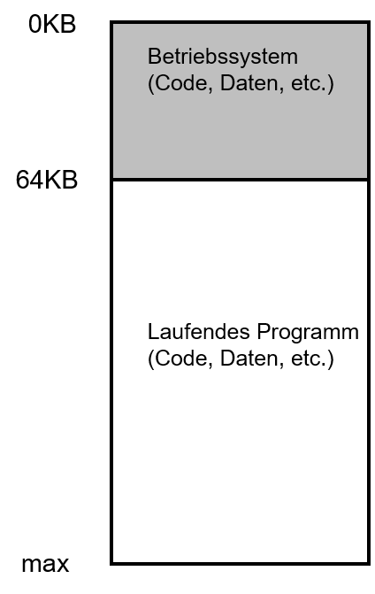
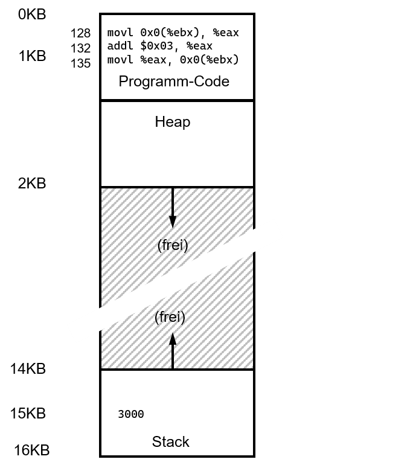

<!--

author:   Andreas Heil

email:    andreas.heil@hs-heilbronn.de

version:  0.1

language: de

narrator: DE German Male

tags: betriebssysteme, lecture, speicher

comment:  

-->


# Speicher

<!-- data-type="none" -->
| Parameter | Kursinformationen |
| --- | --- |
| **Veranstaltung:** | `262007 Betriebssysteme`|
| **Semester** | `SEB2` |
| **Hochschule:** | `Hochschule Heilbronn` |
| **Inhalte:** | `Speicher` |
| Startseite | [https://liascript.github.io/course/?https://raw.githubusercontent.com/aheil/os/master/README.md#1](https://liascript.github.io/course/?https://raw.githubusercontent.com/aheil/os/master/README.md#1) | 
| **Link auf den GitHub:** | [https://github.com/aheil/os/blob/main/lectures/05_speicher.md](https://github.com/aheil/os/blob/main/lectures/05_speicher.md) |
| **Autoren** | @author |

## Lernziele und Kompetenzen

* Grundlagen von Adressräume und Speichervirtualisierung **kennen lernen**
* Unterschiedliche Adressierung von Programminstruktionen, Heap und Stack **verstehen**
* Funktionsweise einer MMU **verstehen** und einfache Adressberechnungen selbst **durchführen können**

## Einfache Speicherverteilung

Am Anfang war alles viel einfacher…
* Betriebssystem war (vollständig) im Hauptspeicher präsent
* Ein laufendes Programm (= Prozess) konnte den Rest des Speichers nutzen
* Einfach zu programmieren

Beispiel: 
* Betriebssystem im Speicherbereich 0KB bis 64KB
* Das laufende Programm nutzt den gesamten restlichen Speicher ab 64KB



---

## Adressräume

Bereits gelernt: 

* Prozesse können vom Betriebssystem »geschedult« werden 
* Jeder Prozess hat einen eigenen Speicherinhalt 
* Im Beispiel vorher muss der Speicherinhalt bei jedem Context Switch weggespeichert und neu geladen werden


{{1}}
************************************

**Speicher aufteilen?** 

Lösungsidee:

* Jeder Prozess bekommt einen Teil vom Speicher

Fragen:

* Wie kann ich den Zugriff auf den Speicherbereich schützen? 
* Was machen wir mit dem freien Speicher?
* Was wenn nur noch viele kleine Speicherbereiche frei sind?


************************************

{{2}}
************************************

 **Die Lösung: Adressräume**

* Einfach zu verwendende Abstraktion des Speichers
* Ein Adressraum (engl. address space) beinhaltet alle Bestandteile des laufenden Programms

**Aufbau von Adressräumen**

* Code

  * Einfach zu laden, da nicht veränderbar

* Stack und Heap

  * Wachsen und schrumpfen
  * Durch entgegengesetzte Anordnung (s.r.) ist dies 	   	gleichzeitig möglich  


************************************

{{3}}
************************************

**Speichervirtualisierung**

* Prozess »denkt« er wurde bei Adresse 0 KB in den Speicher geladen
* Allerdings liegt der Prozess dabei jedoch wo ganz anders
* Hier sprechen wir von einer sog. virtuellen Adresse (engl. virtual address)

 **Ziele der Speichervirtualisierung**

* Transparenz: Der Prozess weiß nichts von seinem Glück und denkt er greift auf physikalischen Speicher zu 
* Effizienz: In Bezug auf Speicher- als auch Zeit (z.B. unterstützt durch Hardware-Features)
* Sicherheit: Prozess müssen voreinander geschützt sein

************************************

## Speicher API 

### Speicherarten: Stack 
 
* Wird implizit (automatisch) reserviert
* Compiler reserviert für die Variable `x` entsprechend Speicher auf dem Stack 
* Speicher wird bei Aufruf von `func` alloziert und beim Verlassen der Routine wieder freigegeben

```c
void func() {
  int x; // declares an integer on the stack
  ...
}
```

### Speicherarten: Heap

* Speicher muss explizit durch Entwickler alloziert werden
* Hinweis: Compiler reserviert Speicher für Pointer, z.B.  `int *x`, auf dem Stack
* Prozess fordert Speicher auf dem Heap für ein Integer an 
* Zurück kommt die Speicheradresse, an der der Integer Wert auf dem Heap liegt

```c
void func() {
  int *x = (int *) malloc(sizeof(int));
  ...
}
```
### Speicher reservieren

Speicher für eine Fließkommazahl reservieren:

```c
double *d = (double *) malloc(sizeof(double));
```

* Compiler kennt die Größe des Datentyps
* Sie auch? 8 Byte, 32-Bit Fließkommazahlen, war schon dran, oder?

Array für 10 Integer-Werte reservieren 

```c
int *x = malloc(10 * sizeof(int));
```

### Speicher freigeben

Allozierten Speicher wieder freigeben

```c
double *x = malloc(10 * sizeof(int));
…
free(x);
```

{{1}}
************************************

**malloc, free und das Betriebssystem**

* `malloc` und `free` beziehen sich immer nur auf den virtuellen Adressraum eines Prozesses
* Auch wenn ein Speicherleck gebaut wird und der gesamte Heap voll läuft gilt:
  * Das Betriebssystem  holt sich nach Prozessende den gesamten Speicher zurück 
  * Kann aber Probleme bei langlaufenden Prozessen (Web Server o.ä. machen)
* Viel größeres Problem wenn im Betriebssystem selbst ein Speicherleck enthalten ist 
* `malloc` und `free` sind selbst keine SysCalls 
* `brk` und `sbrk` sind SysCalls zum Ändern des Heaps
* `mmap` zum Erzeugen eines neuen Speicher-Mappings in den virtuellen Adressraum

************************************


--- 

### Typische Fehler beim Umgang mit Speicher

Was könnte beim Verwalten schon schiefgehen? 

{{1}}
************************************

**Vergessen Speicher zu reservieren** 

```c
char *src = “hello world”;
char *dst;                // Speicher nicht reserviert
strcpy (dst, scr); 
```

▶ Resultiert in sog. » Segmentation Fault«

Korrekt wäre:

```c
char *src = “hello world”;
char *dst = (char *) malloc(strlen(src) + 1);
strcpy (dst, scr); 
```

************************************

{{2}}
************************************

Nicht genügend Speicher reserviert

```c
char *src = “hello world”;
char *dst = (char *) malloc(strlen(src)); // String um 1 Zeichen zu kurz
strcpy (dst, scr); 
```

* Das kann laufen, kann aber auch abstürzen 
* Je nachdem ob `malloc` hier ggf. ein Byte mehr alloziert
* Verlassen sollten Sie sich darauf allerdings nicht… 🙈

************************************

{{3}}
************************************

**Speicher reserviert, aber vergessen zu initialisieren**

* Egal ob initialisiert oder nicht, es wird auf jeden Fall etwas aus dem Speicher gelesen 
* Und zwar das was vorher drin war 😲
* Nennt sich dann »Uninitialized Read«

************************************

{{4}}
************************************

**Speicher nicht freigegeben**

* Ein Klassiker
* Hatten wir schon einmal zu Beginn der Vorlesungsreihe
* Herzlichen Glückwunsch, Sie haben ein Speicherleck (engl. memory leak) gebaut 🤦‍♂️
* Kann man auch bei höheren Programmiersprachen erreichen, indem Referenzen nicht »aufgeräumt« wer

************************************

{{5}}
************************************

**Speicher freigegeben obwohl er noch benötigt wird**

* Klingt schon so, als wäre das keine gute Idee
* Nennt sich »Dangling Pointer«
* GGf. noch benötigte Daten können ab dann durch erneutes `malloc` überschreiben werden

************************************

{{6}}
************************************

**Speicher mehrfach freigeben**

* Man sollte denken, das sollte kein Unterschied machen
* Ergebnis ist allerdings nicht exakt definiert
* Nennt sich »Double Free«
* Immer wieder gut, um die zugrundeliegenden Bibliotheken zur Speicherverwaltung maximal zu verwirren 😵

************************************

## Address Translation 

**Hardware-basierte-Address-Translation**

* Jeder Zugriff auf den virtuellen Adressraum wird durch die Hardware übersetzt 
* Virtuelle Adresse wird dabei in physikalische Adresse umgewandelt
* Aufgabe des Betriebssystems
  * Verwaltung des Speichers (engl. memory management)
  * Verwaltung der freien Speicherbereiche 

Annahmen zum Einstieg:
* Annahme 1: Adressraum ist kleiner als der physikalische Speicher
* Annahme 2: Jeder Adressraum ist gleich groß

{{1}}
************************************

**Code-Beispiel, das einen Wert aus dem Speicher liest, um drei erhöht und wieder zurück schreibt.**

C-Code: 

```c
void func() {
  int x = 3000; // thanks, Perry.
  x = x + 3;    // line of code we are interested in
  ...
}
```

x86-Code:

```
128: movl 0x0(%ebx), %eax  ;load 0+ebx into eax
132: addl $0x03, %eax      ;add 3 to eax register
135: movl %eax, 0x0(%ebx)  ;store eax back to mem
```

1. Adresse von `x` wird in Register `ebx` geladen
2. Wert an der Adresse wird in register `eax` geladen (via move)
3. Addieren von 3 auf den Wert in Register `eax`
4. Wert in `eax` wird zurück in den Speicher geschrieben (selbe Stelle, von der geladen wurde)

  * Instruktion von Adresse 128 laden
  * Instruktion ausführen (Lade von Adresse 15KB)
  * Instruktion von Adresse 132 laden
  * Instruktion ausführen (keine Speicherreferenz)
  * Instruktion von Adresse 135 laden
  * Instruktion ausführen (Speichern in Adresse 15KB)




************************************

{{2}}
************************************

**Blickwinkel** 

* Aus Sicht des Prozesses beginnt der Adressraum bei 0KB und endet bei 16KB
* Alle Speicherreferenzen des Programms müssen sich in diesem Bereich wiederfinden
* In Wirklichkeit lieg der Adressraum jedoch nicht bei 0KB sondern ganz woanders
* Und jetzt soll dieser Adressraum auch noch neu organisiert (verlagert) werden


************************************

{{3}}
************************************

**Base ‚n‘ Bounds und die MMU**

* Zwei spezielle Register auf der CPU: »Base« und »Bounds«
* Jedes Programm wird so kompiliert, als würde es an die Speicheradresse 0 geladen und dort starten
* Betriebssystem entscheidet jedoch wohin das Programm geladen wird und setzt das Base-Register auf diese Adresse 
* Bei jedem Speicherzugriff übersetzt die CPU folgendermaßen

```physical address = virtual address + base```

* Bounds-Register gibt das Limit des physikalischen Adressraums an
* Teil des Prozessors, der bei der Übersetzung hilft wird auch »Memory Management Unit« oder kurz MMU genannt

************************************

{{4}}
************************************

**Hardware Anforderungen**

Damit ein Betriebssystem, das alles kann, existieren einige Anforderungen an die Hardware:

1. **Privilegierter Modus**
  Wird benötigt, um Programme im User Modus daran zu hindern privilegierte Operationen auszuführen 
2. **Base- & Bounds-Register**
  Registerpaar (pro CPU) für Address Translation und Prüfungen der Speicherlimits
3. **Übersetzung und Prüfung virtueller Adressen, Prüfung ob diese innerhalb der vorgegebenen Grenzen liegen**
  Schaltung für die Berechnung und Prüfung
4. **Privilegierte Instruktionen um Base-/Bounds-Register zu ändern**
  Betriebssystem muss dies vor Programmstart setzen können
5. **Privilegierte Instruktionen, um Exception Handler zu registrieren**
Betriebssystem muss der Hardware sagen, welcher Code im Fehlerfall ausgeführt werden soll
6. **Möglichkeit Exceptions zu werfen**
Wenn Prozess versucht außerhalb des virtuellen Adressraums auf Speicher zuzugreifen oder beim Versuch privilegierte Operationen auszuführen

************************************

{{5}}
************************************

 **Herausforderungen**

* Bei Prozessstart muss das Betriebssystem einen geeigneten freier Speicherbereich finden und allozieren
* Bei Prozessende (freiwillig oder anderweitig) muss der Speicher wieder in die Liste mit freiem Speicher eingetragen werden, Datenstrukturen etc. sollten aufgeräumt werden
* Beim Context Switch müssen Base- und Bounds-Register weggespeichert bzw. wiederhergestellt werden (Vereinfachte Annahme: alle Prozesse liegen im Speicher)
* Wird ein Prozess im Speicher re-alloziert, muss der Prozess vorübergehend gestoppt werden
Exception Handlers werden benötigt und müssen vom Betriebssystem bereitgestellt werden

************************************

## Exkurs: Exkurs: Von-Neumann vs Harvard 

**Kurze Wiederholung**

* Einteilung des Adressraums 
  * Statischer Programm-Code
  * Heap- und Stack

* Konsequenzen
  * Sowohl Speicherzugriffe (Variablen lesen/schreiben) als auch Instruktionen laden, läuft über den gleichen Datenbus


### Von-Neumann Architektur


* Von-Neumann-Flaschenhalls
* Heute: Durch Caches kein Engpass mehr, da Befehls- und Speicherzugriffe weitestgehend entkoppelt
* Vorteil: Ein Bus macht das Programmieren einfacher, keine Race-Conditions und Daten-Inkohärenz  (deterministisches Programm auch bei Multi-CPU)

# Harvard Architektur


* Parallelisierung von Befehls- und Datenzugriffen 
In Signalverarbeitung oft genutzt(da möglichst reproduzierbares Verhalten erforderlich)
* Nachteil: Mehrere Adressräume müssen verwaltet werden
* Atmel AVR Prozessor (Arduino)