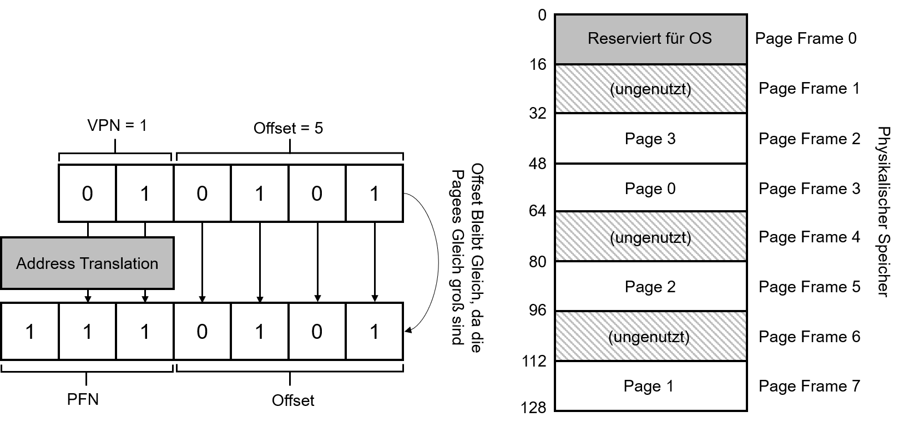

<!--

author:   Andreas Heil

email:    andreas.heil@hs-heilbronn.de

version:  0.1

language: de

narrator: DE German Male

tags: betriebssysteme, lecture, speicherverwaltung

comment:  

-->


# Fortgeschrittene Speicherverwaltung

<!-- data-type="none" -->
| Parameter | Kursinformationen |
| --- | --- |
| **Veranstaltung:** | `262007 Betriebssysteme`|
| **Semester** | `SEB2` |
| **Hochschule:** | `Hochschule Heilbronn` |
| **Inhalte:** | `Fortgeschrittene Speicherverwaltung` |
| Startseite | [https://liascript.github.io/course/?https://raw.githubusercontent.com/aheil/os/master/README.md#1](https://liascript.github.io/course/?https://raw.githubusercontent.com/aheil/os/master/README.md#1) | 
| **Link auf den GitHub:** | [https://github.com/aheil/os/blob/main/lectures/06_speicherverwaltung.md](https://github.com/aheil/os/blob/main/lectures/06_speicherverwaltung.md) |
| **Autoren** | @author |

## Lernziele und Kompetenzen 

- Sie lernen die weiterführenden Konzepte der Speicherverwaltung in modernen Betriebssystemen kennen,
- verstehen wie Speichermanagement mittels einer Free List realisiert werden kann,
- verstehen die Grundlagen des Pagings 

## Grundlegende Überlegung

Wie gehen wir mit großen Adressräumen um?

* Zwischen Heap und Stack liegt ggf. viel (ungenützter) Speicher
* Mit 32-Bit lassen sich 4 GB große Adressräume ansprechen


# Exkurs 

* Unter 32-Bit Windows waren die obersten 2 GB physikalischem Speicher für Windows Reserviert: max. 2 GB virtueller Adressraum 
* Unter 32-Bit Linux 1 GB physikalischem Speicher für Betriebssystem:  max. 3 GB virtueller Adressraum


# Lösung: Segmentierung

* Ein Base- und Bounds-Paar pro logisches Speichersegment des Adressraums
* Was ist eine Speichersegment?
* Zusammenhängender Speicherbereich
* In unserem Fall drei Segmente
  * Programm-Code
  * Heap
  * Stack


## Hardware-Unterstützung

* Folglich: Es müssen drei Base- und Bounds-Paare in der MMU unterstützt werden

* Frage: Woher weiß die CPU welches Segment gemeint ist?

* Lösung: Teile der **virtuellen** Speicheradresse werden für das Segment genutzt 

 

## Base- und Bounds  Beispiel

| Segment | Base | Größe |
| --- | --- | --- |
|Code|32K|2K|
|Heap|34K|3K|
|Segment|28K|2K|


## Segmentation Fault

> Speicherzugriff auf illegale Adresse in segmentiertem (aber auch bei nicht-segmentiertem Speicher)

Wie kann dass passieren?

* Typisch für C-Programmer.
* Aufgrund von Pointer-Arithmetik ist es rechte einfach versehentlich eine Adresse zu »berechnen«, die außerhalb des gültigen Segments liegt

## Adressierung von Code-Segmenten (1)

Beispiel:

* 00 - Code Segment
* 01 - Heap Segment 
* 10 - Stack Segment

Berechnung: 

* Offset + Base-Register: physikalische Speicheradresse 
* Zum Prüfen der Obergrenze, wir die Größe hinzuaddiert


* Was ist mit dem Stack?

  * Hardware-Support durch zusätzliches Bit 

* Aus Effizienzgründen: Speicherbereiche können geteilt werden

  * Hardware-Support durch zusätzliches Protection-Bit
  * Segment kann somit in mehreren virtuellen Adressräumen genutzt werden
 
|Segment|Base|Gräße (max. 4K)|Wächst pos.|Schutz|
|---|---|---|---|---|
|Code|32K|2K|1|Read-Execute|
|Heap|34K|3K|1|Read-Write|
|Stack|28K|2K|0|Read-Write|

## Segmentierung und das Betriebssystem

* Bei Context Switch müssen Segment-Register ebenfalls gesichert/geladen werden
* Was passiert wenn das Speichersegment nicht genügt? 

  * `malloc`-Aufruf liefert Pointer auf Speicherbereich im Heap, Heap ist jedoch zu klein 
  * `sbrk`-SysCall wird ausgeführt, um Heap zu vergrößern 
  * Betriebssystem vergrößert das Segment und aktualisiert die entsprechenden Register 
  * Hinweis: Vergrößerung kann vom Betriebssystem zurückgewiesen werden (Programm hat bereits genügend Speicher oder es gibt keinen physikalischen Speicher mehr)

## Fragmentierung

Speicherfragmentierung (engl. external fragmentation)
* Ursprüngliche Annahme: Alle virtuellen Adressräume sind gleich groß, das ist leider in der Realität nicht so
* Für Segmente müssen passende Speicherbereiche gesucht werden 
* Physikalischer Speicher besteht somit schnell aus einer Vielzahl an belegten Speicherabschnitten und Löchern
* Speicher muss vom Betriebssystem komprimiert werden 

## Exkurs: MS-DOS und EMM386.SYS

* Unter MS-DOS gab es Anfangs ein 640KB Limit
* Um den Speicher optimal auszunutzen musste der Speicher händisch optimiert werden, z.B. 
  * durch Nutzung zusätzlicher Tools zur Speicherverwaltung
  * händisches Anordnen der zu ladenden Treiber, um Lücken im 
  * Speicher möglichst zu vermeiden (minimieren)

Hausaufgabe:

* Lesen Sie [The 640K memory limit of MS-DOS](https://www.xtof.info/blog/?p=985) 

## config.sys

```
[common]

SWITCHES=/f#
DOS=NoAutoDOS=high,umb
BUFFERSHIGH=40
FILESHIGH=20
FCBSHIGH=1
LASTDRIVEHIGH=m
DEVICE=c:\drivers\qhmboot.sys
DEVICE=c:\drivers\umbpci.sys /i=e000-efff
DEVICEHIGH=c:\drivers\qhimem.sys /n48
DEVICE=c:\windows\himem.sys
DEVICEHIGH=c:\windows\emm386.exe ram auto
DEVICEHIGH=c:\windows\ifshlp.sys
DEVICEHIGH=c:\drivers\usbaspi.sys /v
DEVICEHIGH=c:\drivers\di1000dd.sys
INSTALL=c:\drivers\ctmouse.exe
DEVICEHIGH=c:\drivers\qcdrom.sys /D:mycdrom
INSTALL=c:\drivers\shcdx33a.com /D:mydrom

``` 

## Free List 

* Bisher galt die Annahme, das alle Adressräume gleich sind
* Somit muss man »eigentlich nur« die nächste freie Lücke finden und »auffüllen«
* Segmentierung führt nun jedoch zur Fragmentierung (engl. external fragmentation)
* Innerhalb eines Adressraus spricht man ebenfalls von Fragmentierung (engl. internal fragmentation)

Beispiel: Heap


* Eine Datenstruktur zur Verwaltung freier Speicherbereiche ist die sog. Free List
* Basiert auf einer verketteten Liste (engl. linked list)


## Free List Beispiele 

* Anfragen für größer 10 Bytes schlagen fehl (liefert NULL)
* Exakt 10 Bytes kann durch einen der beiden Blöcke bedient werden 
* Aber was passiert, wenn nur 1 Byte angefordert wird?


* Anfragen für größer 10 Bytes schlagen fehl (liefert NULL)
* Exakt 10 Bytes kann durch einen der beiden Blöcke bedient werden 
* Aber passiert, wenn nur 1 Byte angefordert wird?
* Einer der freien Blöcke wird verkleinert…


* Zurück zur Ausgangssituation mit drei Blöcken…
* Was passiert wenn der mittlere Block freigegeben wird? 
* Es entstehen drei Blöcke… keine Gute Idee…


* Daher fasst die zuständige Bibliothek den freien Speicher vor dem Allokieren so gut wie möglich zusammen


## Paging 

* Bisher gelernt: Segmentierung führt früher oder später dazu, dass der Speicher fragmentiert…
* Glücklicherweise nutzen Betriebssysteme noch einen zweiten Mechanismus der Speicherverwaltung: Paging
* Dabei wird der Speicher in fixe Einheiten aufgeteilt 

  * Jede solche fixe Einheit heißt Page (dt. Speicherseite)
  * Der physikalische Speicher ist demnach eine Aneinanderreihung von gleichgroßen Slots 
  * Jeder solcher Slot heißt Page Frame (dt. Seitenrahmen)
  * Jeder Frame kann eine Page enthalten 

# Paging Beispiel 

Hier ein einfaches Beispiel:

  * 64-Byte virtueller Adressraum
  * 4 Pages a 16-Byte Pages
  * Betriebssystem muss »nur« vier freie Page Frames finden
  * Dafür gibt es eine Free List mit freien Page Frames
  * Datenstruktur mit den Einträgen wo eine Page im physikalischen Speicher liegt, heißt Page Table (dt. Seitentabelle)
  * Es gibt eine Page Table pro Prozess

## Zuordnung von Frames 


## Paging und Address Translation

* Unser Beispiel zuvor hatte ein 64-Byte Adressraum  
* Nun versuchen wir Daten aus einer virtuellen Adresse `<virtual address>` in das Register `eax` zu laden
* Hierfür benötigen wir zwei Komponenten

  * Virtual Page Number (VPN)
  * Offset (innerhalb der Page)


In Assembler:

```asm
movl <virtual address>, %eax
```

* Wir haben 16-Byte Seiten in einem 64-Byte Adressraum 
* Es müssen 4 Seiten adressiert werden können 
* Daher die 2-Bit Virtual Page Number (VPN)
* Die restlichen Bits können zur Adressierung innerhalb der Seite verwendet werden (= Offset)

* Beispiel:
  * Zugriff auf virtuelle Adresse 21
  * 21 im Dezimalsystem in ist 010101 Binär, ist 15 im Hexadezimalsystem
  * Somit Zugriff auf Byte5 in Page 1


In Asssembler: 

```
movl 15h, %eax
```

* Die physikalische Adresse1 von Page 1 ist 7 (= 111)
* Physical Frame Number (PFN) oder auch Physical Page Number (PPN)



---

## Wo liegen Page Tables?

* Page Tables können sehr groß werden 

  * Pro Eintrag 20-Bit VPN + 12-Bit Offset für 4KB Pages
  * 20-Bit VPN bedeuten 220 Adressberechnungen pro Prozess (ca. 1 Million)  
  * 100 Prozesse in einem 32-Bit System bedeuten ca. 400 MB nur für die Page Tables
  * In 64-Bit Systemen nochmals einiges mehr

* Daher keine extra Hardware (Speicher) in der MMU
* Anstelle dessen werden Sie im Hauptspeicher vorgehalten

  * Konkret im virtuellen Speicher des Betriebssystems vorgehalten

---

## Beispiel: x86 Page-Table-Eintrag

* Present Bit (P): Liegt die Page im Hauptspeicher oder auf Disk (Swapping kommt später)
* Read/Write Bit (R/W): Darf in die Page geschrieben werden
* User/Supervisor Bit (U/S): Kann ein User-Mode Prozess auf die Page zugreifen
* PWT, PCD, PAT u. G: Beschreiben Hardware-Caching 
* Accessed Bit (A): Wird für einen sog. “Least recently used page”-Algorithmus genutzt
* Dirty Bit (D): Wurde der Speicherinhalt verändert 
* PFN: Page Frame Number 

